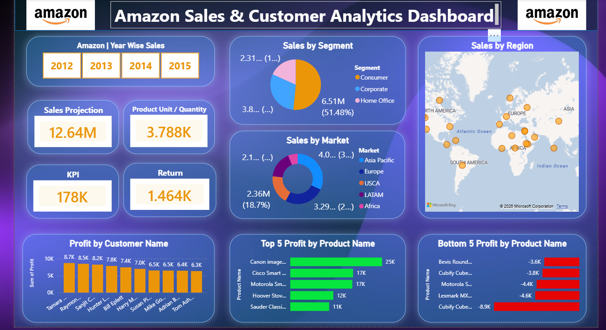

# Amazon Sales & Customer Analytics Dashboard

## 📌 Project Overview
The **Amazon Sales & Customer Analytics Dashboard** is an interactive Power BI dashboard designed to analyze sales performance, customer behavior, regional trends, and product profitability.  
It helps businesses make data-driven decisions through visual insights and KPI tracking.

---

## 🚀 Features

### 📊 Sales Analysis
- Year-wise sales filtering (2012–2015)
- Total sales projection analysis
- Product quantity tracking

### 👥 Customer Insights
- Sales distribution by customer segment:
  - Consumer
  - Corporate
  - Home Office
- Profit analysis by customer name

### 🌍 Regional & Market Analysis
- Global sales distribution map
- Market-wise sales contribution:
  - Asia Pacific
  - Europe
  - USCA
  - LATAM
  - Africa

### 💰 Profitability Insights
- Top 5 profitable products
- Bottom 5 loss-making products
- KPI and return analysis

---

## 🛠️ Tools & Technologies
- Power BI
- DAX
- Power Query
- Excel / CSV Dataset
- Data Visualization

---

## 📈 Key Metrics

| KPI | Value |
|------|------|
| Sales Projection | 12.64M |
| Product Quantity | 3.788K |
| KPI | 178K |
| Returns | 1.464K |

---

## 📷 Dashboard Preview

---

## 📌 Business Insights
- Consumer segment contributes the highest sales share.
- Asia Pacific and Europe markets generate strong revenue.
- Some products consistently generate losses and require optimization.
- Customer-level profitability helps identify valuable customers.

---

## 📂 Files Included
- `Amazon_Sales_Dashboard.pbix`
- `dataset.csv`
- `README.md`

---

## ▶️ How to Use
1. Download the `.pbix` file.
2. Open using Power BI Desktop.
3. Interact with filters and charts to explore insights.

---

## 🔮 Future Improvements
- Sales forecasting
- Customer retention analysis
- Real-time data integration
- Drill-through reports

---

## 👨‍💻 Author
**Chinmay Satam**  
Data Analyst | SQL | Power BI | Python

### 🔗 LinkedIn
[Chinmay Satam](https://www.linkedin.com/in/chinmaysatam85/)

---
